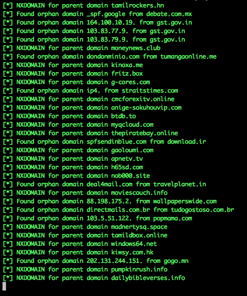

* Finding Expired SPF 

What it does? 
- Feed in a CSV file from Alexa top 1m 
- Multithreaded, increase to any numbers as you want 
- It will take a domain from the CSV file, perform a DNS TXT request and get all the SPF related domains 
- It will then recursively query each SPF domain, 
	- If CNAME exists, it will do the checking on all CNAMEs
	- If CNAME does not exist, it will check for NXDOMAIN
		- If NXDOMAIN returns, you can now go ahead and hijack the SPF recrod by registering it 

